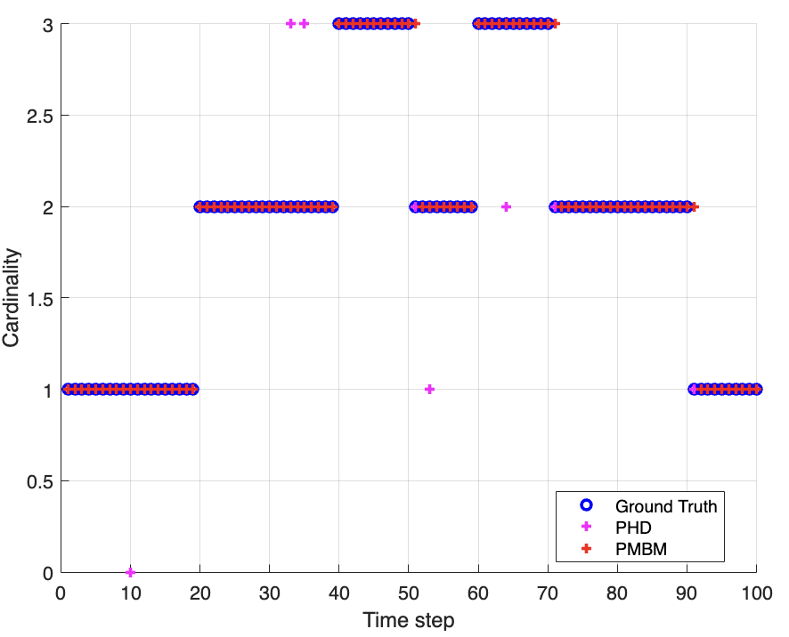
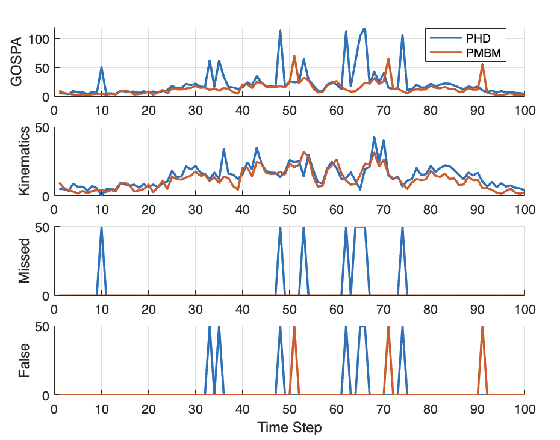
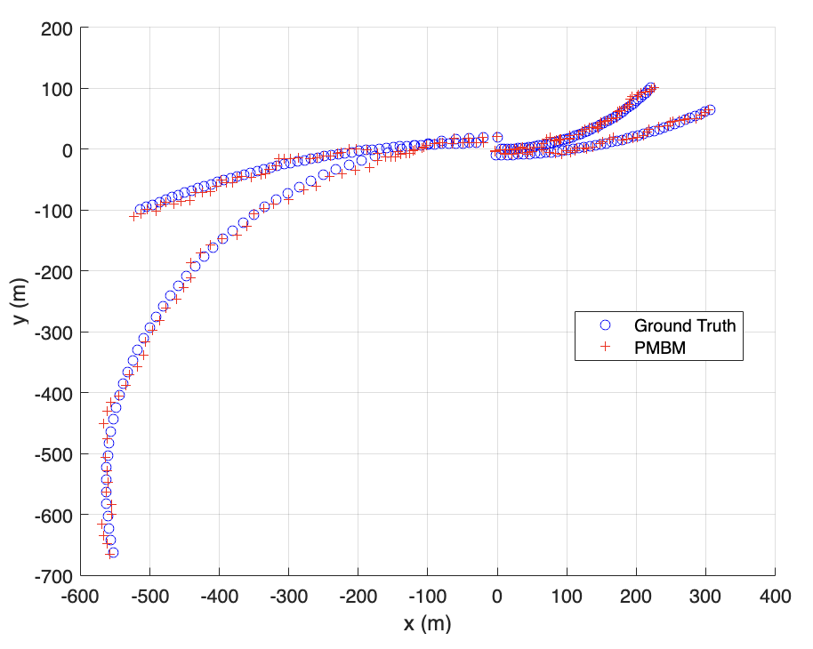

# Multi-Object-Tracking

This repository contains MATLAB assignments completed for the course **"Multi-Object Tracking for Automotive Systems"** offered by EDX Chalmers University of Technology. Each assignment focuses on implementing various tracking algorithms for automotive applications.

---

## Home-Assignment 01 (HA01) - Single-Object Tracking in Clutter

### Implemented Algorithms:
- Nearest Neighbors Filter (NN)
- Probabilistic Data Association Filter (PDA)
- Gaussian Sum Filter (GSF)

---

## Home-Assignment 02 (HA02) - Tracking n Objects in Clutter

### Implemented Algorithms:
- Global Nearest Neighbors Filter (GNN)
- Joint Probabilistic Data Association Filter (JPDA)
- Track-oriented Multiple Hypothesis Tracker (TO-MHT)
---

## Home-Assignment 03 (HA03) - Random Finite Sets

### Implemented Algorithms:
- Probability Hypothesis Density Filter (PHD)
- Gaussian Mixture Probability Hypothesis Density Filter (GM-PHD)

---

## Home-Assignment 04 (HA04) - MOT Using Conjugate Priors

### Implemented Algorithms:
- Multi-Bernoulli Mixture filter (MBM)
- Poisson Multi-Bernoulli Mixture filter (PMBM)

---

## Prerequisites

To run the code in this repository, ensure the following:
- MATLAB (R2020b or later recommended)
- Statistics and Machine Learning Toolbox (if applicable)

---
## Results and Metrics

This section provides a summary of the results obtained from the implemented algorithms, captured in the following files:

1. **Cardinality**
   - This file contains the cardinality estimates for each time step, comparing the predicted and ground truth values.
   - **Screenshot:**
     

2. **Metrics**
   - Includes performance metrics such as OSPA (Optimal Subpattern Assignment) and GOSPA (Generalized OSPA) scores, highlighting the accuracy of the tracking algorithms.
   - **Screenshot:**
     

3. **Nonlinear Prediction Ground Truth**
   - This file visualizes the ground truth trajectories versus the predicted trajectories for nonlinear models.
   - **Screenshot:**
     

